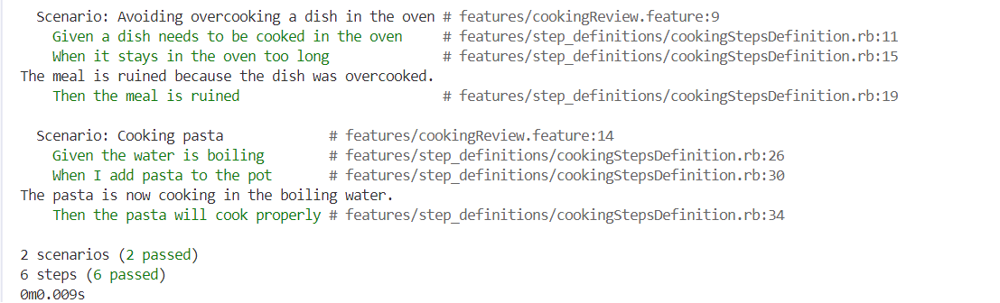

= R5.A.08 -- Dépôt pour les TPs
:icons: font
:MoSCoW: https://fr.wikipedia.org/wiki/M%C3%A9thode_MoSCoW[MoSCoW]

Ce dépôt concerne les rendus de mailto:A_changer@etu.univ-tlse2.fr[Jonh Doe].

== TP1

.Exemple de code
[source,java]
---
@Given("today is Sunday")
public void today_is_sunday() {
    // Write code here that turns the phrase above into concrete actions
    throw new io.cucumber.java.PendingException();
}
---

.Exemple d'image insérée en asciidoc
image::artifacts-r303.svg[width=80%]

== TP2

.Exemple de code
[source,java]

---
    @Then("there is {int} cocktail in the order")
    public void no_cocktail(int nbCocktails){
        List<String> cocktails = order.getCocktails();
        assertEquals(nbCocktails, cocktails.size());
    }
---

== TP3

.Exemple de code
[source,Ruby]

---
  Scenario: Cooking pasta
    Given the water is boiling
    When I add pasta to the pot
    Then the pasta will cook properly
    
Given("the water is boiling") do
  @water = { temperature: 100, has_pasta: false }
end

When("I add pasta to the pot") do
  @water[:has_pasta] = true
end

Then("the pasta will cook properly") do
  expect(@water[:has_pasta]).to be true
  puts "The pasta is now cooking in the boiling water."
end
---

